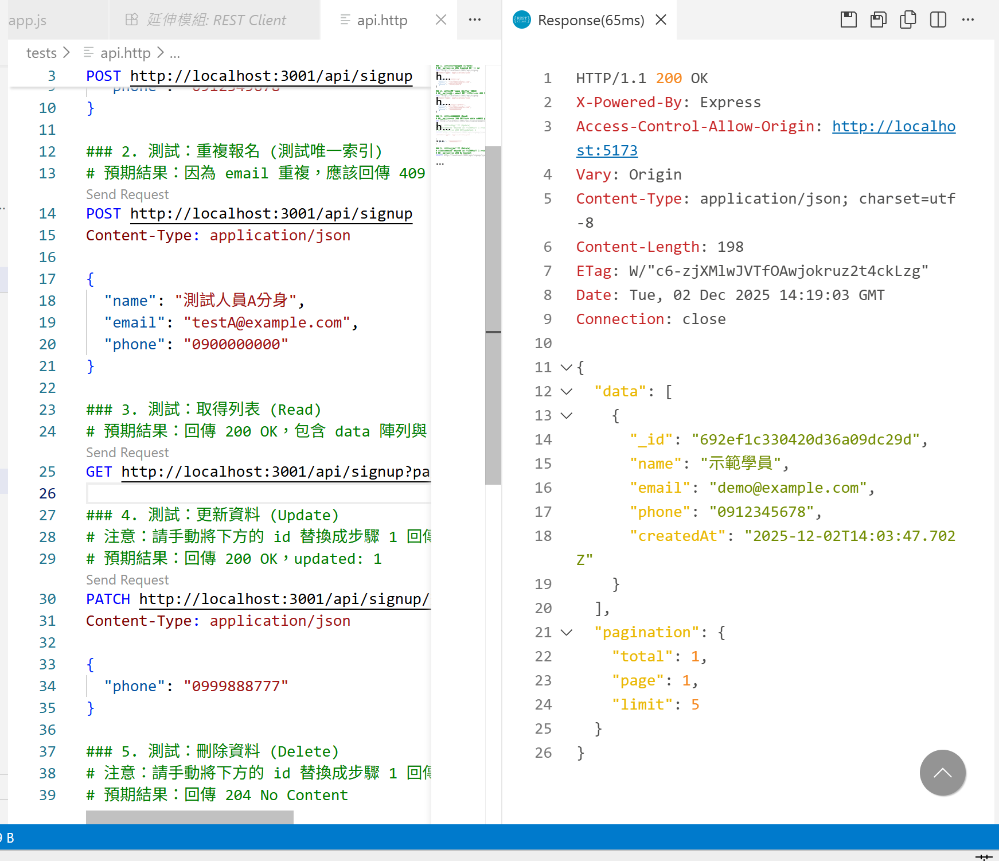
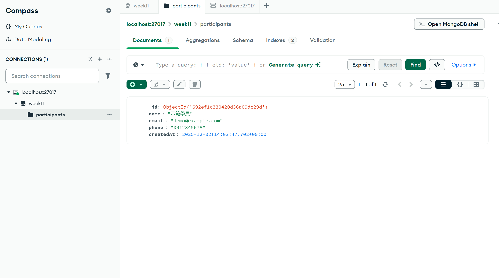

# Week 11 Lab：報名資料庫實作

##  專案結構
Week11/
├── docker/
│   ├── docker-compose.yml  # 定義 MongoDB 服務
│   ├── mongo-init.js       # 初始化資料庫使用者與 Collection
│   └── mongo-data/         # (自動生成) 資料庫檔案掛載點
├── server/
│   ├── repositories/       # 資料庫操作層 (CRUD)
│   ├── routes/             # API 路徑定義
│   ├── app.js              # 應用程式入口
│   ├── db.js               # 資料庫連線設定
│   └── .env                # 環境變數設定
└── tests/
    └── api.http            # REST Client 測試腳本
## 📸 實作截圖證明
### 1. Docker 容器運作狀態 (docker ps)

### 2. Mongosh 資料查詢結果

### 3. API 測試成功畫面 (REST Client)

### 4. MongoDB Compass 資料結構
